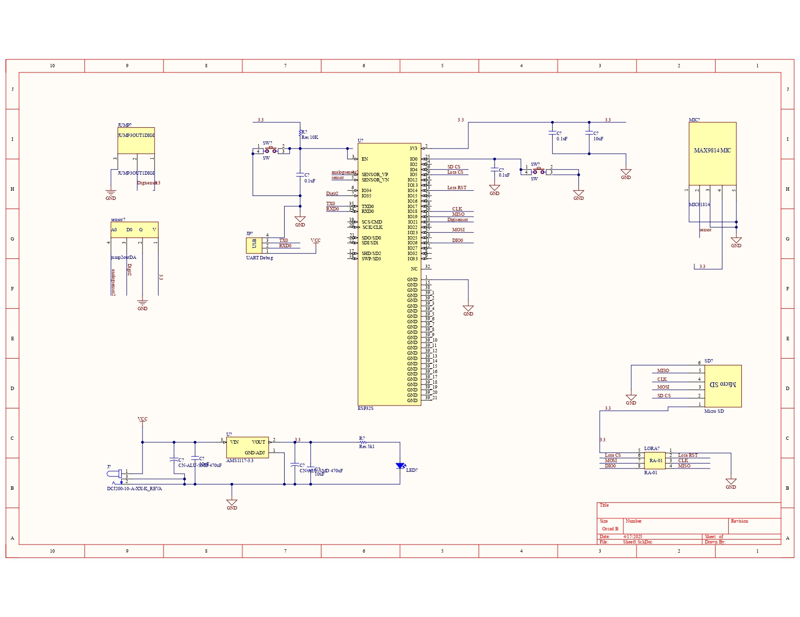
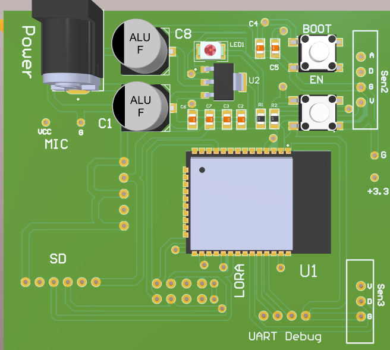
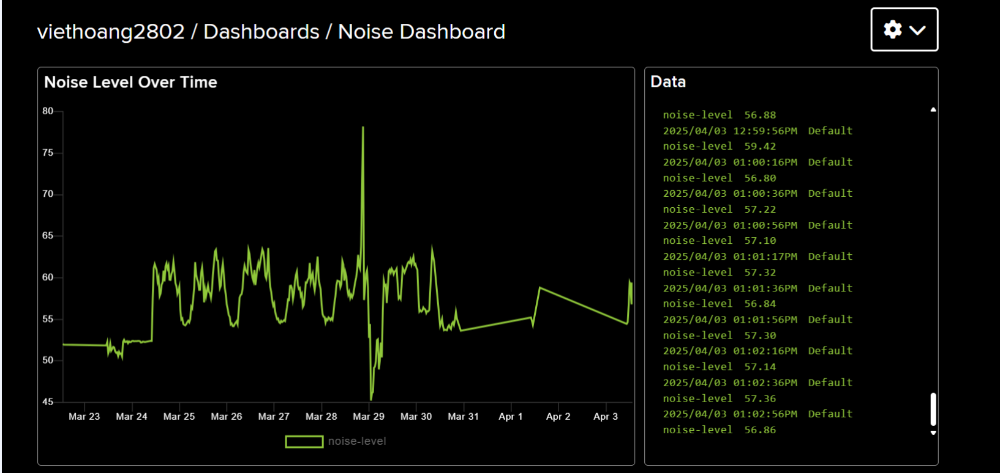

# 🔌 Hệ thống đo mức độ tiếng ồn trong khu vực đô thị
# Người làm chính: Nguyễn Bá Việt Hoàng - B21DCDT100
> Dự án xây dựng một hệ thống giám sát tiếng ồn sử dụng cảm biến âm thanh và mạng truyền thông LoRa. Hệ thống gồm ba node: thu thập, truyền và lưu trữ dữ liệu âm thanh môi trường. Dữ liệu được lưu trên thẻ microSD và đồng thời gửi lên nền tảng IoT Adafruit.io để hiển thị. Dự án phục vụ mục đích nghiên cứu và giáo dục, hướng đến việc ứng dụng công nghệ IoT trong giám sát ô nhiễm tiếng ồn đô thị.
---

## 📑 Mục Lục

- [Giới thiệu](#giới-thiệu)
- [Thông số kỹ thuật](#thông-số-kỹ-thuật)
- [Danh sách linh kiện](#danh-sách-linh-kiện)
- [Sơ đồ nguyên lý và PCB](#sơ-đồ-nguyên-lý-và-pcb)
- [Hướng dẫn lắp ráp](#hướng-dẫn-lắp-ráp)
- [Lập trình firmware](#lập-trình-firmware)
- [Cách sử dụng](#cách-sử-dụng)
- [Kiểm thử](#kiểm-thử)
- [Ảnh/Video demo](#ảnhvideo-demo)
- [Đóng góp](#đóng-góp)
- [Giấy phép](#giấy-phép)

---

## 👋 Giới Thiệu

 “Hệ thống đo mức độ tiếng ồn trong khu vực đô thị” nhằm xây dựng một hệ thống giám sát tiếng ồn sử dụng mạng truyền thông LoRa với ba node cảm biến. Node 1 gồm ESP32S kết hợp cảm biến âm thanh MAX9814 để thu thập dữ liệu môi trường, xử lý và chuyển đổi thành giá trị tương đương dB. Dữ liệu sau đó được truyền không dây đến Node 2 – đóng vai trò trung chuyển – và tiếp tục gửi đến Node 3. Node 3 nhận dữ liệu, lưu vào thẻ nhớ microSD và đồng thời cập nhật lên nền tảng IoT Adafruit.io để hiển thị trực quan và lưu trữ lâu dài. Hệ thống được thiết kế nhằm phục vụ mục tiêu giáo dục và nghiên cứu, giúp sinh viên tiếp cận thực tiễn công nghệ truyền thông không dây, xử lý tín hiệu cảm biến và ứng dụng IoT. Dự án sẽ được kiểm thử thực tế trong vòng 7 ngày để đánh giá hiệu quả hoạt động và khả năng ứng dụng trong việc theo dõi, phân tích ô nhiễm tiếng ồn tại các khu vực đô thị.

---

## 📐 Thông Số Kỹ Thuật

| Thành phần     | Thông tin            |
|----------------|----------------------|
| MCU            | ESP32S               |
| Nguồn vào      | 5V qua USB hoặc DC   |
| Kết nối        | WiFi, Lora           |
| Kích thước PCB | 60mm x 70mm          |

---

## 🧰 Danh Sách Linh Kiện

| Tên linh kiện            | Số lượng | Ghi chú                     |
|--------------------------|----------|-----------------------------|
| ESP32S                   | 3        | Vi điều khiển chính         |
| Module Lora Ra01         | 3        | Truyền dữ liệu              |
| LED xanh                 | 3        | Đèn báo nguồn               |
| MAX9814                  | 1        | Cảm biến âm thanh           |
| Module đọc MicroSD       | 1        | Hỗ trợ ghi dữ liệu          |
| AMS1117-3.3              | 3        | Chuyển đổi điện áp
| Nút nhấn                 | 3        | Điều khiển thủ công         |
| Tụ [0.1uf,10uf,470uf]    | 24       | Lọc nhiễu, là phẳng điện áp |
| Trở [5k1,10k]            | 6        | Hạn dòng, điện trở kéo      |
| Jack nguồn DC            | 3        | Nguồn                       |
| Jump                     | 3        | Cắm UART                    |

---

## 🔧 Sơ Đồ Nguyên Lý và PCB

- 📎 [Schematic (PDF)](docs/Schematic_Lora.pdf)
- 📎 [PCB Layout (Gerber)](docs/Gerber.zip)
- 📎 [File thiết kế (Altium)](docs/fullprojectdesign.zip)

_Hình minh họa sơ đồ nguyên lý hoặc board PCB có thể nhúng ngay tại đây:_

---

## 🔩 Hướng Dẫn Lắp Ráp

1. Bôi thiếc hàn lên tất cả các pad smd.
2. Đặt các linh kiện smd lên. 
3. Đặt ESP32S lên pad hàn.
4. Bôi thiếc hàn lên trên chân của ESP32.
5. Khò hàn tất cả cho đến khi thiếc chảy hết.
6. Hàn tiếp các linh kiện cắm bằng mũi hàn.
7. Kiểm tra bằng mắt, kết hợp đồng hồ đo.
8. Nạp firmware.

---

## 💻 Lập Trình Firmware

- **Ngôn ngữ:** C++ (Arduino)
- 📎 [SourceCode](Sourcecode)
- **Cách nạp:** Sau khi đã compile thành công chương trình, bắt đầu nhấn nụt nạp trên Arduino IDE. Giữ nút boot trên board rồi đợi đến lúc IDE hiện chữ connecting...rồi nhấn và thả nút Reset.
  
## 📜 Cách sử dụng

- Sau khi đã nạp xong firmware, ta sẽ cấp nguồn 5V cho cả 3 node.
- Sau khi cấp nguồn thì nhấn nút EN/Reset trên cả 3 mạch.
- Muốn xem log truyền tin giữa các node thì có thể cấp nguồn bằng UART.
- Kiểm tra trên web Adafruit.io nếu đã nhận được dữ liệu đẩy lên thì mạch đã hoạt động đúng.

## 💿 Kiểm thử

## 🎞️ Ảnh/Video demo
https://private-user-images.githubusercontent.com/156501341/435402061-04e07901-b8c4-47a6-8766-bfb23d1321f1.mp4?jwt=eyJhbGciOiJIUzI1NiIsInR5cCI6IkpXVCJ9.eyJpc3MiOiJnaXRodWIuY29tIiwiYXVkIjoicmF3LmdpdGh1YnVzZXJjb250ZW50LmNvbSIsImtleSI6ImtleTUiLCJleHAiOjE3NDUwNzUwODMsIm5iZiI6MTc0NTA3NDc4MywicGF0aCI6Ii8xNTY1MDEzNDEvNDM1NDAyMDYxLTA0ZTA3OTAxLWI4YzQtNDdhNi04NzY2LWJmYjIzZDEzMjFmMS5tcDQ_WC1BbXotQWxnb3JpdGhtPUFXUzQtSE1BQy1TSEEyNTYmWC1BbXotQ3JlZGVudGlhbD1BS0lBVkNPRFlMU0E1M1BRSzRaQSUyRjIwMjUwNDE5JTJGdXMtZWFzdC0xJTJGczMlMkZhd3M0X3JlcXVlc3QmWC1BbXotRGF0ZT0yMDI1MDQxOVQxNDU5NDNaJlgtQW16LUV4cGlyZXM9MzAwJlgtQW16LVNpZ25hdHVyZT1jMDQwNTRlZjgzOWYzNGIxODNiZDE5ZWE0YjE0Y2U0M2MxOGZmYzcxOTgzMmQxMmI2ZWI0NDliZGNiMWQzZDhmJlgtQW16LVNpZ25lZEhlYWRlcnM9aG9zdCJ9.2w96RrguRFl_zu4LSO7ULRKF_O6pDouDRltqa7MFOOQ

Xem thêm các video demo khác tại:
- 📎 [DEMOVIDEO](docs/images)

## 👐 Đóng góp

Dự án được thực hiện với mục đích học tập và nghiên cứu. Mọi ý kiến đóng góp, đề xuất hoặc phản hồi đều được hoan nghênh. Nếu bạn muốn đóng góp, vui lòng tạo một Pull Request hoặc Issue để thảo luận thêm.

## ©️ Giấy phép

Dự án này được phát hành dưới giấy phép MIT License. Bạn có thể tự do sử dụng, chỉnh sửa và phân phối lại với điều kiện giữ nguyên thông tin bản quyền.

  

